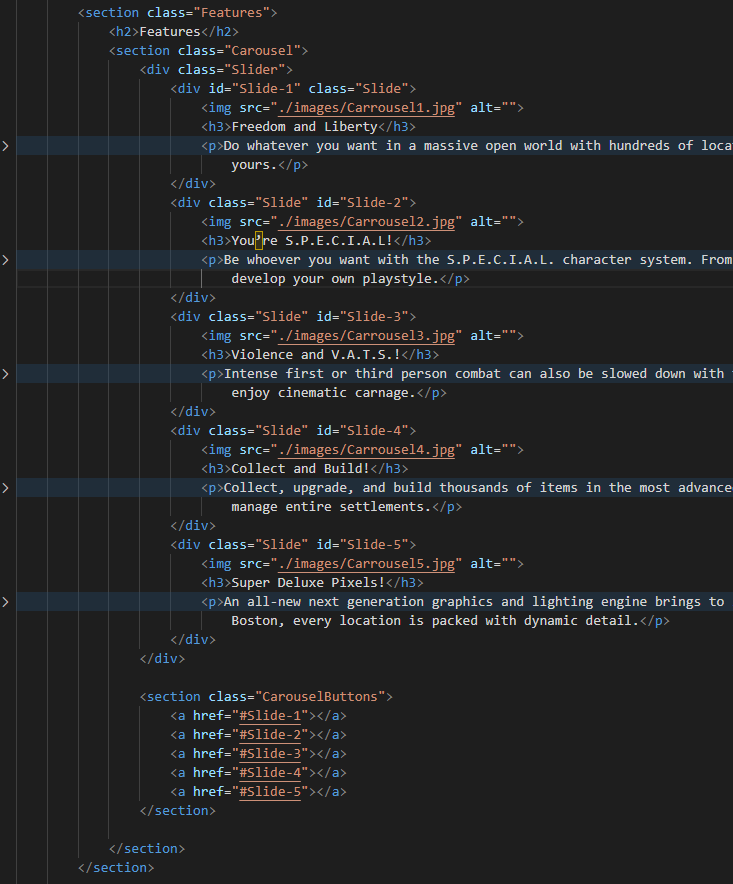
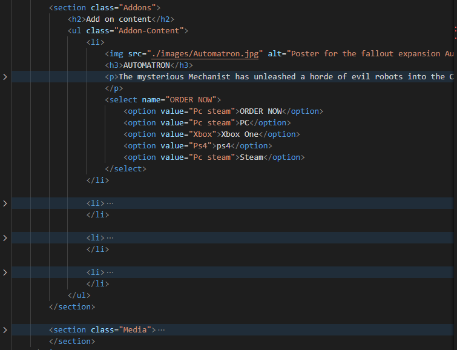
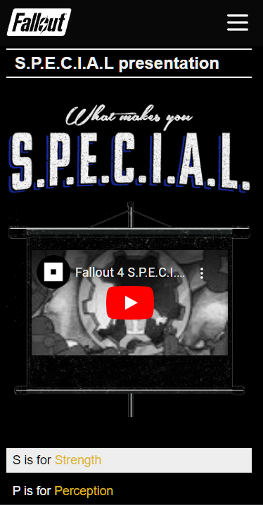
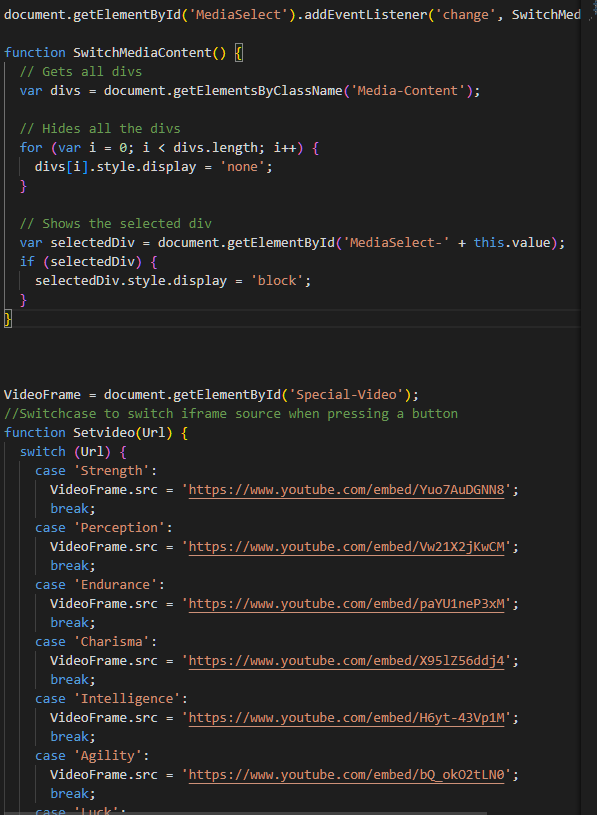

# Procesverslag
Markdown is een simpele manier om HTML te schrijven.  
Markdown cheat cheet: [Hulp bij het schrijven van Markdown](https://github.com/adam-p/markdown-here/wiki/Markdown-Cheatsheet).

Nb. De standaardstructuur en de spartaanse opmaak van de README.md zijn helemaal prima. Het gaat om de inhoud van je procesverslag. Besteedt de tijd voor pracht en praal aan je website.

Nb. Door *open* toe te voegen aan een *details* element kun je deze standaard open zetten. Fijn om dat steeds voor de relevante stuk(ken) te doen.

## Jij

  ### Auteur:
  Furkan Tura

  #### Je startniveau:
  Rood

  #### Je focus:
  Surface plane
 

## Je website

  
uitwerken voor kick-off werkgroep

  ### Je opdracht:
  link naar de website die je gaat namaken óf de naam/omschrijving van je eigen ontwerp
  https://fallout.bethesda.net/en/games/fallout-4
  https://fallout.bethesda.net/en/apps
  
  #### Screenshot(s) van de eerste pagina (small screen): 
  

  #### Screenshot(s) van de tweede pagina (small screen):
  
 

## Toegankelijkheidstest 1/2 (week 1)

  
uitwerken na test in 2e werkgroep

  Link naar test
  https://docs.google.com/document/d/152VWy9axcYVYJL9g7FBjnwfO5Nzs3bG4XXyLcdn5mAI/edit?usp=sharing 
  
  ### Bevindingen
  Deze website gebruikt heel veel classes die maar 1 gebruikt worden, Img hebben geen alt, Geen dark en lightmode en de headings springen heel veel heen en slaan headings over.

## Breakdownschets (week 1)

  
uitwerken na afloop 3e werkgroep

  ### de hele pagina: 
  

## Voortgang 1 (week 2)

  
uitwerken voor 1e voortgang

  ### Stand van zaken
  Begonnen met opzet van pagina en als allereerste een hamburger menu in de nav
  Verder gegaan met nav menu en begonnen aan content verwerken met als allereerste de about fallout section. 
  geen uitdagingen op misschien de lijn naast de tekst na.

  ### Agenda voor meeting
  samen met je groepje opstellen

  | student 1      | student 2          | student 3    | student 4        |
  | ---            | ---                | ---          | ---              |
  | dit bespreken  | en dit             | en ik dit    | en dan ik dat    |
  | en dat ook nog | dit als er tijd is | nog een punt | dit wil ik zeker |
  | ...            | ...                | ...          | ...              |

  ### Verslag van meeting
  hier na afloop snel de uitkomsten van de meeting vastleggen

  - punt 1
  - punt 2
  - nog een punt
  - ...

## Voortgang 2 (week 3)

  
uitwerken voor 2e voortgang

  ### Stand van zaken
  Heb de Features section afgemaakt met een css caroussel en heb ook de add on content section afgemaakt. 
  Alles ging soepel maar de caroussel werkt niet helemaal naar wensen zoals de bolletjes blijven niet wit wanneer je er op drukt en hij springt naar de knoppen ipv de top van de section.

  Html code van de features section, Voor de css check mijn commit: 0a08185
  

  Html code van de add ons section, Voor de css check mijn commit: b57a362
  

  ### Agenda voor meeting
  samen met je groepje opstellen

  | student 1      | student 2          | student 3    | student 4        |
  | ---            | ---                | ---          | ---              |
  | dit bespreken  | en dit             | en ik dit    | en dan ik dat    |
  | en dat ook nog | dit als er tijd is | nog een punt | dit wil ik zeker |
  | ...            | ...                | ...          | ...              |

  ### Verslag van meeting
  hier na afloop snel de uitkomsten van de meeting vastleggen

  - punt 1
  - punt 2
  - nog een punt
- ...

## Toegankelijkheidstest 2/2 (week 4)

  
uitwerken na test in 9e werkgroep

  	https://docs.google.com/document/d/1dz-vEOPQcTrGItx6XxtF_ZAf8_3S5cT6nJG3h55ZKs8/edit?usp=sharing Link naar Test 2
  ### Bevindingen
  -Niet alle img hebben een alt. 
  
  Slaagt voor bijna alle onderdelen na een paar korte updates zoals alt text toevoegen aan img's en een darkmode die is gebaseerd op de user system settings
  de code daarvan is terug te vinden in commit(e7521e7).

## Voortgang 3 (week 4)

  
uitwerken voor 3e voortgang

  ### Stand van zaken
  Veel werk aan de verschillende onderdelen van de media section zoals het vormgeven van de alle 2 soorten pagina's met 1 stukje voor afbeeldingen en 1 stukje voor videos en afbeelding. 
  Special section afgemaakt met een klein stukje javascript(Switch case die wisselt van src van de iframe met een id). Wat niet helemaal werkt op dit moment is het positioneren van de video over de afbeelding heen want het moest gehard code worden wat niet ideaal is maar goed genoeg voor deze situatie.

  ### Agenda voor meeting
  samen met je groepje opstellen

  | student 1      | student 2          | student 3    | student 4        |
  | ---            | ---                | ---          | ---              |
  | dit bespreken  | en dit             | en ik dit    | en dan ik dat    |
  | en dat ook nog | dit als er tijd is | nog een punt | dit wil ik zeker |
  | ...            | ...                | ...          | ...              |

  ### Verslag van meeting
  hier na afloop snel de uitkomsten van de meeting vastleggen

  - punt 1
  - punt 2
  - nog een punt
  - ...

## Eindgesprek (week 5)

  
uitwerken voor eindgesprek

  ### Je uitkomst - karakteristiek screenshots:
  

  ### Dit ging goed/Heb ik geleerd: 
  Het programmeren ging best makkelijk en het ging best wel goed en ik heb ook geleerd om meer gestructureerd te programmeren ipv heel veel classes voor losse elementen.\
  Ik vond het ook fijn om een keer niet een website te moeten ontwerpen maar iets namaken omdat meer kon focussen op het programmeren en elementen werkend krijgen.
  
  

  ### Dit was lastig/Is niet gelukt:
  Ik had niet veel problemen die ik niet kon oplossen, Javascript was wel een beetje lastig maar nadat ik het voor mezelf had opgedeeld werd het een stuk makkelijker.\
  De Media section was verreweg het lastigste omdat er zoveel content in zit want naar dat ik voor 5 verschillende sections moest maken moest het ook werkend zijn met javascript uiteindelijk heb ik het bereikt met een functie die kijkt naar veranderingen van de drop down en zet daarna de sections die over 1 komen de display mode naar block van none.\

  

## Bronnenlijst

  
continu bijhouden terwijl je werkt

  Nb. Wees specifiek ('css-tricks' als bron is bijv. niet specifiek genoeg). 
  Nb. ChatGpT en andere AI horen er ook bij.
  Nb. Vermeld de bronnen ook in je code.
  1. https://codepen.io/chriscoyier/pen/XwbNwX?editors=1100 Carousel Css
  2. https://css-tricks.com/can-get-pretty-far-making-slider-just-html-css/ 
  3. https://css-tricks.com/snippets/css/complete-guide-grid/ 
  4. https://cssgridgarden.com/#nl 
  5. https://css-tricks.com/dark-modes-with-css/
  6. https://stackoverflow.com/questions/62835905/javascript-function-to-change-iframe-video 
  7. https://stackoverflow.com/questions/17212094/fill-background-color-left-to-right-css 

